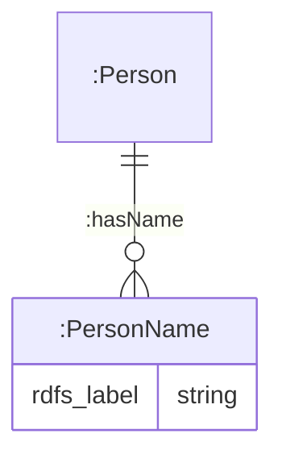

# Examples

This directory provides examples for different applications of the agent.

# Table of Contents

- [1. SHACL Restrictions](#1-shacl-restrictions)
  - [1.1 Form Generation](#11-form-generation)
    - [1.1.1 Branching Form](#111-branching-form)
    - [1.1.2 Property Groups](#112-property-groups)
    - [1.1.3 Dependent form fields](#113-dependent-form-fields)
    - [1.1.4 Array Field](#114-array-field)
    - [1.1.5 Lifecycle-specific Feature](#115-lifecycle-specific-feature)
    - [1.1.6 Role-based data access](#116-role-based-data-access)
  - [1.2 Automated Data Retrieval](#12-automated-data-retrieval)
  - [1.3 SHACL Derivation](#13-shacl-derivation)
    - [1.3.1 Virtual or persist derivation](#131-virtual-or-persist-derivation)
- [2. Schemas](#2-schemas)
  - [2.1 Instantiation](#21-instantiation)
    - [2.1.1 Array](#211-array)
    - [2.1.2 Form Branch](#212-form-branch)
    - [2.1.3 Service Lifecycle](#213-service-lifecycle)
  - [2.2 Geocoding](#22-geocoding)
- [3. Appendix](#3-appendix)
  - [3.1 TWA-SHACL extension](#31-twa-shacl-extension)

## 1. SHACL Restrictions

[SHACL](https://www.w3.org/TR/shacl/) is generally a language for validating RDF graphs against a set of conditions. The World Avatar incorporates these restrictions into our workflow to populate form structure and fields, as well as enabling automated data retrieval.

### 1.1 Form Generation

The query to generate the form template is available at `resources/query/construct/form.sparql`. Please read the documentation available on the [viz](https://github.com/TheWorldAvatar/viz/blob/main/doc/form.md) repository to understand how the form template generated from this agent should look like.

A sample SHACL format in (TTL) is described below:

```
base:NameOfConceptShape
  a sh:NodeShape ;
  sh:targetClass base:Concept ;
  sh:property [
    sh:name "subclass dropdown" ;
    sh:order 1 ;
    sh:description "A sample property showing the structure for creating a new dropdown and its list of selections from the target class and its subclasses" ;
    sh:path ontoexample:hasDropdownOptions ;
    sh:in ontoexample:DropdownOption ;
    sh:minCount 1 ;
    sh:maxCount 1 ;
  ] ;
  sh:property [
    sh:name "list of subclasses dropdown" ;
    sh:order 2 ;
    sh:description "A sample property showing the structure for creating a new dropdown and its list of selections from a list of at least one target class and its subclasses" ;
    sh:path ontoexample:hasDropdownOptions ;
    sh:in (ontoexample:DropdownOptionOne ontoexample:DropdownOptionTwo) ;
    sh:minCount 1 ;
    sh:maxCount 1 ;
  ] ;
  sh:property [
    sh:name "instance dropdown" ;
    sh:order 3 ;
    sh:description "A sample property showing the structure for creating a new dropdown and its list of selections from instances associated with the target class" ;
    sh:path ontoexample:hasDropdownForInstances ;
    sh:class ontoexample:ExampleClass ;
    sh:minCount 1 ;
    sh:maxCount 1 ;
  ] ;
  sh:property [
    sh:name "text input";
    sh:description "A sample property showing the structure for creating a new text input field" ;
    sh:order 4 ;
    sh:path ontoexample:hasInput ;
    sh:datatype xsd:string ;
    sh:minCount 1 ;
    sh:maxCount 1 ;
  ] ;
  sh:property [
    sh:name "number input";
    sh:description "A sample property showing the structure for creating a new numerical input field" ;
    sh:order 5 ;
    sh:path ontoexample:hasInput ;
    sh:datatype xsd:decimal ;
    sh:minCount 1 ;
    sh:maxCount 1 ;
  ] ;
  sh:property [
    sh:name "date input";
    sh:description "A sample property showing the structure for creating a new date input field" ;
    sh:order 6 ;
    sh:path ontoexample:hasInput ;
    sh:datatype xsd:date ;
    sh:minCount 1 ;
    sh:maxCount 1 ;
  ] .

base:ExampleClassShape
  a sh:NodeShape ;
  sh:targetClass ontoexample:ExampleClass ;
  sh:property [
    sh:name "name";
    sh:description "Name of the example class instance.";
    sh:order 0;
    sh:path rdfs:label ;
    sh:datatype xsd:string ;
    sh:minCount 1 ;
    sh:maxCount 1 ;
  ] .
```

The following SHACL value constraints will be extracted and present in the form template:

1. sh:minCount
2. sh:maxCount
3. sh:minInclusive
4. sh:maxInclusive
5. sh:minExclusive
6. sh:maxExclusive
7. sh:minLength
8. sh:maxLength
9. sh:pattern
10. `sh:defaultValue`: Accepts either an IRI `<iri>`or string literal `"string"`
11. <https://theworldavatar.io/kg/form/step>: Defines the increment between valid numbers for a numeric input field

- When combined with the `sh:pattern` attribute, it enforces specific format requirements. For example, with the pattern `\.(00|15|30|45|60)$` and a `0.05` step, the field will increment to the nearest value matching the pattern within that step. Ensure the step value does not exceed the pattern's granularity; `0.15` steps would fail to meet the `\.(00|15|30|45|60)$` pattern, while `0.01` steps are inefficient.

1. <https://theworldavatar.io/kg/form/singleLine>: A (`true`/`false`) boolean indicating if a text area input is required. MUST be used with a `sh:datatype xsd:string`.

> [!IMPORTANT]  
> There is no need to include an `id` property shape in the SHACL config, as the agent has its own mechanism to retrieve the identifier that is typically generated using the relationship `http://purl.org/dc/terms/identifier` IF the instance was added by the agent. If the instance was uploaded via other means, please ensure that the relevant instances contains the relationship so that the agent can return the right results when querying for specific instances.

> [!NOTE]  
> Read [this appendix](#31-twa-shacl-extension) for a complete list of `SHACL` properties that has been extended for TWA.

### 1.1.1 Branching Form

Users can generate branching forms using the `sh:or` logical constraint. This generates a form with a category dropdown. Selecting a category displays a different set of form fields. Each branch requires a separate node shape without a `sh:targetClass` property, but with `sh:name` and `sh:description` properties. These properties populate the category dropdown.

> [!TIP]
> In scenarios where one of the branches do not have additional unique properties, users can generate this branch with an empty SHACL node shape without any property constraints. But only one variant of this is allowed at any time.

> [!TIP]
> Users can reorder the category listed in the form by adding an optional `sh:order` property in the node shape.

> [!IMPORTANT]
> `sh:or` is only permittable at the top level, and not within groups or `sh:node`.

A sample SHACL format in (TTL) for `sh:or` is described below:

```
base:CoreShape
  a sh:NodeShape ;
  sh:targetClass ontoexample:ExampleClass ;
  sh:property [
    sh:name "common field";
    sh:description "A common field that will be rendered for all branches.";
    sh:path rdfs:label ;
    sh:datatype xsd:string .
  ] ;
  sh:or (
    base:BranchOneShape
    base:BranchTwoShape
  ) .

base:BranchOneShape
  a sh:NodeShape ;
  sh:name "branch one" ;
  sh:description "The first branch or set of form rendered" ;
  sh:property [
    sh:name "field one";
    sh:description "A field specific to branch one.";
    sh:path ontoexample:hasInput ;
    sh:datatype xsd:string .
  ] .

base:BranchTwoShape
  a sh:NodeShape ;
  sh:name "branch two" ;
  sh:description "The second branch or set of form rendered" ;
  sh:property [
    sh:name "field two";
    sh:description "A field specific to branch two.";
    sh:path ontoexample:hasSecondInput ;
    sh:datatype xsd:string .
  ] ;
  sh:property [
    sh:name "extra field";
    sh:description "An extra field rendered when branch two is selected.";
    sh:path ontoexample:hasExtraInput ;
    sh:datatype xsd:string .
  ] .
```

### 1.1.2 Property Groups

Users may group form inputs into one form section either by using Nested Concepts via `sh:node` or `PropertyGroup` via sh:group.

A sample SHACL format in (TTL) for `sh:node` is described below:

```
base:NameOfConceptShape
  a sh:NodeShape ;
  sh:targetClass base:Concept ;
  sh:property [
    sh:name "group" ;
    sh:description "A sample property showing the structure for creating a new property group" ;
    sh:order 0 ;
    sh:path ontoexample:hasGroup ;
    sh:node base:NestedConceptShape ;
    sh:minCount 1 ;
    sh:maxCount 1 ;
  ] .

base:NestedConceptShape
  a sh:NodeShape ;
  sh:targetClass ontoexample:NestedConcept ;
  sh:property [
    sh:name "nested input" ;
    sh:order 1 ;
    sh:description "A sample property showing the structure for creating a nested property input as part of a group" ;
    sh:path ontoexample:hasNestedProperty ;
    sh:datatype xsd:string ;
    sh:minCount 1 ;
    sh:maxCount 1 ;
  ] .
```

A sample SHACL format in (TTL) for `PropertyGroup` is described below:

```
base:ExampleGroupPropertyShape
  a sh:NodeShape ;
  sh:targetClass ontoexample:ExampleGroupClass ;
  sh:property [
    sh:name "name";
    sh:description "Name of the example group class instance.";
    sh:order 0;
    sh:path rdfs:label ;
    sh:datatype xsd:string ;
    sh:minCount 1 ;
    sh:maxCount 1 ;
  ] ;
  sh:property [
    sh:name "group string input";
    sh:description "String input for a form section.";
    sh:group base:ExampleFormSectionGroup ;
    sh:order 1;
    sh:path ontoexample:hasInput ;
    sh:datatype xsd:string ;
    sh:minCount 1 ;
    sh:maxCount 1 ;
  ] ;
  sh:property [
    sh:name "group dropdown";
    sh:description "A dropdown for a form section.";
    sh:group base:ExampleFormSectionGroup ;
    sh:order 2;
    sh:path ontoexample:hasDropdownOption ;
    sh:class ontoexample:DropdownOption ;
    sh:minCount 1 ;
    sh:maxCount 1 ;
  ] .

base:ExampleFormSectionGroup
  a sh:PropertyGroup ;
  rdfs:label "form section" ;
  sh:description "An example form section grouping properties through SHACL." ;
  sh:order "2"^^xsd:integer .
```

> [!IMPORTANT]
> `PropertyGroup` are most useful for setting dependent form fields, which relies on some form field.

### 1.1.3 Dependent Form Fields

Users can set up dependencies between form fields by targeting the independent form property (via the corresponding `PropertyShape`) using the `https://theworldavatar.io/kg/form/dependentOn` relations. A sample SHACL file in TTL is given below:

```
base:FormDependencyShape
  a sh:NodeShape ;
  sh:targetClass base:Concept ;
  sh:property base:FormDependencyShape-independent ;
  sh:property [
    sh:name "dependent field" ;
    sh:order 2 ;
    sh:description "A sample property showing a dependent field" ;
    sh:path ontoexample:isDependent ;
    sh:class ontoexample:DependentClass ;
    twa:dependentOn base:FormDependencyShape-independent;
    sh:minCount 1 ;
    sh:maxCount 1 ;
  ] .

base:FormDependencyShape-independent a sh:PropertyShape ;
  sh:name "independent field" ;
  sh:order 1 ;
  sh:description "A sample property showing an independent field" ;
  sh:path ontoexample:isIndependent ;
  sh:class ontoexample:IndependentClass ;
  sh:minCount 1 ;
  sh:maxCount 1 .
```

### 1.1.4 Array Field

Users may generate an array field within the form by either removing the `maxCount` property or setting the `maxCount` property to at least 2. The array field may be displayed in the [viz](https://github.com/TheWorldAvatar/viz) either as a standalone field or grouped as an array section. The display of a standalone array field can be configured following the sample `TTL`.

```
base:StandaloneArrayShape
  a sh:NodeShape ;
  sh:targetClass base:Concept ;
  sh:property [
    sh:name "contact" ;
    sh:order 1 ;
    sh:description "A sample property showing a standalone field array for contact information" ;
    sh:path ontoexample:hasContact ;
    sh:datatype xsd:integer ;
    sh:minCount 1 ;
  ] .
```

When there are several array fields, users can choose to group these fields into one or multiple groups to reduce the form complexity. A grouped array will be displayed as an array of one form section with multiple fields. Users may choose to implement these grouping using either the `sh:node` or `PropertyGroup` [approach](#112-property-groups).

```
base:GroupArrayShape
  a sh:NodeShape ;
  sh:targetClass base:Concept ;
  sh:property [
    sh:name "name";
    sh:description "A sample property showing a standalone field array for the contact's name" ;
    sh:group base:ExampleContactGroup ;
    sh:order 0;
    sh:path rdfs:label ;
    sh:datatype xsd:string ;
    sh:minCount 1 ;
    sh:maxCount 1 ;
  ] ;
  sh:property [
    sh:name "contact" ;
    sh:description "A sample property showing a standalone field array for contact information" ;
    sh:group base:ExampleContactGroup ;
    sh:order 1 ;
    sh:path ontoexample:hasArray ;
    sh:datatype xsd:decimal ;
    sh:minCount 1 ;
    sh:maxCount 1 ;
  ] .

base:ExampleContactGroup
  a sh:PropertyGroup ;
  rdfs:label "contact details" ;
  sh:description "An example form section grouping properties of contact person and number through SHACL." ;
  sh:order "1"^^xsd:integer ;
  sh:minCount 1 .
```

> [!TIP]
> To make an array group optional, set its `minCount` attribute to 0.

> [!WARNING]
> A grouped array field is determined by the group's `maxCount` property, the `maxCount` values of individual property shapes are disregarded in the form. Set them to 1 for validation if needed. To make individual properties optional, set their respective `minCount` value to 0.

> [!CAUTION]
> Array fields cannot be nested within a nested array group, for example, `rootShape sh:property/sh:node propGroup. propGroup sh:property/sh:group nestedGroup.` will not work.

### 1.1.5 Lifecycle-specific Feature

> [!IMPORTANT]
> For any lifecycle form, users will be required to configure the event occurrences using `SHACL` restrictions. Typically, `TerminatedServiceEvent`, `IncidentReportEvent`, `ContractRescission`, and `ContractTermination` can only accommodate a remarks property. For the `ServiceDispatchEvent`, users may assign additional dispatch details through defining more `SHACL` properties. Note that an id field must be included for a `ServiceDispatchEvent`. A sample file has been created in `./shacl.ttl`

> [!IMPORTANT]
> Users can configure a pricing model for the agreement following the sample SHACL in `./pricing.ttl`. This will have to be used alongside the corresponding `JSON-LD` at `./jsonld/pricing.jsonld`. Users must update the possible list of classes in line 85 of the SHACL constraints. No modifications are required for the `JSON-LD` file.

### 1.1.6 Role-based data access

Access to specific fields can be controlled through setting the optional `https://theworldavatar.io/kg/form/role` property in the `SHACL` shapes to a list of permissible roles. A simple example has been set up below.

```
base:ConceptShape
  a sh:NodeShape ;
  sh:targetClass ontoexample:Concept ;
  sh:property [
    sh:name "public"
    sh:description "A field that can be view by anyone"
    sh:order 0;
    sh:path ontoexample:publicPath ;
    sh:datatype xsd:string ;
  ];
  sh:property [
    sh:name "operation"
    sh:description "A field that can only be viewed by a user with the operation role"
    sh:order 1;
    sh:path ontoexample:operationPath ;
    sh:datatype xsd:string ;
    twa-form:role "operation" ;
  ];
  sh:property [
    sh:name "task-viewer"
    sh:description "A field that can only be viewed by a user with the task-viewer role"
    sh:order 2;
    sh:path ontoexample:taskViewerPath ;
    sh:datatype xsd:string ;
    twa-form:role "task-viewer" ;
  ];
  sh:property [
    sh:name "multi-role"
    sh:description "A field that can only be viewed by a user with either the operation or task-viewer role"
    sh:order 3;
    sh:path ontoexample:multiRolePath ;
    sh:datatype xsd:string ;
    twa-form:role "operation;task-viewer" ;
  ].
```

> [!TIP]
> Do **NOT** use the property IF the field should be accessed by anyone

> [!IMPORTANT]
> The property **MUST** target a string literal with semi-colon delimiters

### 1.1.7 Billing-specific Feature

When billing is required, users must define a `SHACL` shape for `https://spec.edmcouncil.org/fibo/ontology/FND/ProductsAndServices/PaymentsAndSchedules/PaymentObligation` and `https://spec.edmcouncil.org/fibo/ontology/FBC/ProductsAndServices/ClientsAndAccounts/IndividualTransaction`.

#### 1.1.7.1 PaymentObligation

This shape must include two Property Shapes:

1. Provides the requesting party of a contract
2. Provides the pricing model, which is dependent on the requesting party

An example minimal shape is provided below. Users can change the `sh:description` for both shapes, and the `sh:path` property for the requesting party shape to fit their needs.

```
base:PaymentObligationShape
  a sh:NodeShape ;
  sh:targetClass fibo-fnd-pas-psch:PaymentObligation ;
  sh:property base:PaymentObligationShape-requesting-party ;
  sh:property [
    sh:name "pricing model" ;
    sh:description "The pricing model to be quoted to the requesting party." ;
    sh:order 2;
    sh:path fibo-fnd-rel-rel:mandates ;
    sh:class fibo-fbc-fi-ip:PricingModel;
    twa:dependentOn base:PaymentObligationShape-requesting-party ;
    sh:minCount 1 ;
    sh:maxCount 1 ;
  ] .

base:PaymentObligationShape-requesting-party
  a sh:PropertyShape ;
  sh:name "requesting party - This can be changed" ;
  sh:description "The party that purchases professional services from, or has a formal relationship to purchase services from the service provider under this agreement." ;
  sh:order 1;
  sh:path [MUST CHANGE PATH ACCORDINGLY] ;
  sh:class fibo-fnd-org-fm:FormalOrganization ;
  sh:minCount 1 ;
  sh:maxCount 1 .
```

#### 1.1.7.2 IndividualTransaction

This shape must include three Property Shapes to indicate the discounts, additional charges, and chargeable waiting time, and this MUST not be changed. However, users must also include two SHACL rules to:

1. Derive the service charges for the event
2. Derive the total bill amount from the service price, discounts, and additional charges for that event

An example minimal shape is provided below. Users should only change the WHERE contents of the (1) SHACL rule to get the pricing model and calculate the final service charge.

```
base:TransactionShape
  a sh:NodeShape ;
  sh:targetClass fibo-fbc-pas-caa:IndividualTransaction ;
  sh:property [
    sh:name "chargeable waiting time" ;
    sh:description "Waiting time to be charged" ;
    sh:order 1;
    sh:path (
      cmns-doc:isAbout
    ) ;
    sh:datatype xsd:decimal ;
    sh:minCount 1 ;
    sh:maxCount 1 ;
  ] ;
  sh:property [
    sh:name "discounts" ;
    sh:description "Discounts to be subtracted from the total charge." ;
    sh:order 2;
    sh:path (
      cmns-doc:isAbout
      p2p-o-inv:hasInvoiceLine
    ) ;
    sh:node base:DiscountInvoiceLineShape ;
    sh:minCount 0 ;
  ] ;
  sh:property [
    sh:name "additional charges" ;
    sh:description "Additional charges to be added to total charge." ;
    sh:order 3;
    sh:path (
      cmns-doc:isAbout
      p2p-o-inv:hasInvoiceLine
    ) ;
    sh:node base:AddChargeInvoiceLineShape ;
    sh:minCount 0 ;
  ] ;
  sh:rule [
    a sh:SPARQLRule ;
    sh:order 0 ;
    sh:construct """
    PREFIX cmns-col: <https://www.omg.org/spec/Commons/Collections/>
    PREFIX cmns-doc: <https://www.omg.org/spec/Commons/Documents/>
    PREFIX cmns-dsg: <https://www.omg.org/spec/Commons/Designators/>
    PREFIX cmns-qtu: <https://www.omg.org/spec/Commons/QuantitiesAndUnits/>
    PREFIX dc-terms: <http://purl.org/dc/terms/>

    PREFIX fibo-fnd-acc-cur: <https://spec.edmcouncil.org/fibo/ontology/FND/Accounting/CurrencyAmount/>
    PREFIX fibo-fnd-arr-lif: <https://spec.edmcouncil.org/fibo/ontology/FND/Arrangements/Lifecycles/>
    PREFIX fibo-fnd-rel-rel: <https://spec.edmcouncil.org/fibo/ontology/FND/Relations/Relations/>
    PREFIX fibo-fnd-pas-pas: <https://spec.edmcouncil.org/fibo/ontology/FND/ProductsAndServices/ProductsAndServices/>
    PREFIX p2p-o-doc-line:   <https://purl.org/p2p-o/documentline#>
    PREFIX p2p-o-inv:        <https://purl.org/p2p-o/invoice#>
    PREFIX ontoservice:      <https://www.theworldavatar.com/kg/ontoservice/>
    PREFIX xsd:              <http://www.w3.org/2001/XMLSchema#>

    CONSTRUCT {
      ?invoice p2p-o-inv:hasInvoiceLine ?invoice_line_instance.
      ?invoice_line_instance p2p-o-doc-line:lineNote "Service"^^xsd:string;
        p2p-o-doc-line:hasLineNetAmount ?invoice_line_amount_instance.
      ?invoice_line_amount_instance cmns-qtu:hasNumericValue ?service_price.
    } WHERE { 
      ?this fibo-fnd-rel-rel:involves ?event_id;
        dc-terms:identifier ?id.
      ?invoice cmns-doc:isAbout ?this.
      ?iri a fibo-fnd-pas-pas:ServiceAgreement;
        fibo-fnd-arr-lif:hasLifecycle/fibo-fnd-arr-lif:hasStage/cmns-col:comprises ?event_id;
        fibo-fnd-rel-rel:confers/fibo-fnd-rel-rel:mandates ?price_model.
      ?event_id ^cmns-doc:refersTo/cmns-doc:records/cmns-qtu:hasQuantityValue ?weight;
        fibo-fnd-rel-rel:exemplifies ontoservice:ServiceDeliveryEvent;
        cmns-dsg:describes ontoservice:CompletedStatus .
      ?price_model cmns-qtu:hasArgument/fibo-fnd-acc-cur:hasAmount ?base_fee;
        cmns-qtu:hasArgument ?var_fee_instance.
      ?base_fee ^fibo-fnd-acc-cur:hasAmount/a ontoservice:BaseFee.
      ?var_fee_instance a ontoservice:VariableFee;
        fibo-fnd-acc-cur:hasAmount ?var_fee;
        cmns-qtu:hasLowerBound/cmns-qtu:hasNumericValue ?lower_bound.
      BIND((?base_fee+(?weight-?lower_bound)*?var_fee) AS ?service_price)

      BIND(IRI(CONCAT("https://theworldavatar.io/kg/account/transaction/invoice/line/",?id)) AS ?invoice_line_instance)
      BIND(IRI(CONCAT("https://theworldavatar.io/kg/account/transaction/invoice/line/amount/",?id)) AS ?invoice_line_amount_instance)
    }
    """
  ] ;
  sh:rule [
    a sh:SPARQLRule ;
    sh:order 1 ;
    sh:construct """
    PREFIX cmns-doc:        <https://www.omg.org/spec/Commons/Documents/>
    PREFIX cmns-qtu:        <https://www.omg.org/spec/Commons/QuantitiesAndUnits/>
    PREFIX dc-terms:        <http://purl.org/dc/terms/>
    PREFIX fibo-fnd-acc-cur:<https://spec.edmcouncil.org/fibo/ontology/FND/Accounting/CurrencyAmount/>
    PREFIX fibo-fnd-rel-rel:<https://spec.edmcouncil.org/fibo/ontology/FND/Relations/Relations/>
    PREFIX p2p-o-doc-line:  <https://purl.org/p2p-o/documentline#>
    PREFIX p2p-o-inv:       <https://purl.org/p2p-o/invoice#>
    PREFIX ontoservice:     <https://www.theworldavatar.com/kg/ontoservice/>
    PREFIX xsd:             <http://www.w3.org/2001/XMLSchema#>

    CONSTRUCT {
      ?this fibo-fnd-acc-cur:hasMonetaryAmount ?total_instance.
      ?total_instance a fibo-fnd-acc-cur:CalculatedPrice; 
        fibo-fnd-acc-cur:hasAmount ?total.
    } WHERE { 
      ?this fibo-fnd-rel-rel:involves ?event_id;
        dc-terms:identifier ?id.
      ?invoice cmns-doc:isAbout ?this;
        p2p-o-inv:hasInvoiceLine ?invoice_line_instance.
      ?invoice_line_instance p2p-o-doc-line:lineNote "Service"^^xsd:string;
        p2p-o-doc-line:hasLineNetAmount/cmns-qtu:hasNumericValue ?service_price.
      OPTIONAL{
        SELECT ?invoice (SUM(?charge) AS ?temp_add_charges) WHERE {
          ?invoice cmns-doc:isAbout ?this;
            p2p-o-inv:hasInvoiceLine/p2p-o-doc-line:hasGrosspriceOfItem/cmns-qtu:hasNumericValue ?charge .
        } GROUP BY ?invoice 
      }
      BIND(COALESCE(?temp_add_charges,0) AS ?add_charges)
      OPTIONAL{ 
        SELECT ?invoice (SUM(?charge) AS ?temp_discount) WHERE {
          ?invoice cmns-doc:isAbout ?this;
            p2p-o-inv:hasInvoiceLine/p2p-o-doc-line:hasPriceDiscountOfItem/cmns-qtu:hasNumericValue ?charge .
        } GROUP BY ?invoice }
      BIND(COALESCE(?temp_discount,0) AS ?discount)
      BIND(?service_price+?add_charges-?discount AS ?total)
      BIND(IRI(CONCAT("https://theworldavatar.io/kg/account/transaction/total/",?id)) AS ?total_instance)
    }
    """
  ] .
```

### 1.2 Automated Data Retrieval

This agent can dynamically query fields for different instances based on the `SHACL` restrictions in three steps:

1. Retrieve all the predicate paths set in `SHACL` to reach the field of interest
2. Generate a dynamic query based on these paths queried in (1)
3. Query the knowledge graph with the query generated in (2)

The query in (1) is available at `resources/query/get/property_path.sparql`. For more information on role-based data access, please read [this section](#116-role-based-data-access). This path specifically requires the following `SHACL` properties in order to function:

1. `sh:path`: REQUIRED to generate the `SPARQL` query template. The subject of this predicate can either be one path IRI or a list of path IRI. An example in `TTL` is also available below:

```
base:ConceptShape
  a sh:NodeShape ;
  sh:targetClass ontoexample:Concept ;
  sh:property [
    ...
    sh:path ontoexample:onePath ;
    ...
  ];
  sh:property [
    ...
    sh:path (ontoexample:nestedPath rdfs:label);
    ...
  ];
  sh:property [
    ...
    sh:path (
      [sh:inversePath ontoexample:inversePath]
      ontoexample:inverseNestedPath
    );
    ...
  ].
```

1. `sh:hasValue`: Optional parameter to restrict the output of the query to a specific instance. This is useful if the same predicate path points to multiple instances as a subject and cannot be differentiated otherwise. For example: `fibo-fnd-dt-fd:RegularSchedule` has predicates `fibo-fnd-dt-fd:hasRecurrenceInterval` that may target Monday to Sunday as their subject values.
2. `sh:minCount`: Optional parameter to indicate that the variable is required in the template if set above one.
3. `sh:datatype`: Required parameter to generate min-max search criteria based on integer or decimal settings
4. `sh:property/sh:name "name"`: Optional `SHACL` property that provides property path(s) to the human-readable label of the field. This is required for any IRIs returned by any property if human-readable labels are necessary. This must be found in a property shape with `sh:targetClass` to function. Note that if your property is `sh:in` a (sub)class, the agent will automatically retrieve the `rdfs:label` of the associated class concept.

## 1.3 SHACL Derivation

Users are able to derive additional triples using `SHACL` rules. This requires the following setup:

1. A `JSON-LD` template describing the data model input for instantiation
2. A `SHACL` rule associated with the class of the primary data model
3. Adding a key value pair in the `application-service.json` file for (1)
4. Adding a key value pair in the `application-form.json` file for (2)

An example is provided below:

1. `JSON-LD` template

```json
{
  "@id": {
    "@replace": "id",
    "@type": "iri",
    "prefix": "https://example.org/kg/calculation/"
  },
  "@type": "http://example.org/Calculation",
  "http://example.org/hasArg": {
    "@type": "http://example.org/Weight",
    "http://example.org/hasValue": {
      "@replace": "weight",
      "@type": "literal",
      "datatype": "http://www.w3.org/2001/XMLSchema#decimal"
    }
  }
}
```

1. `SHACL` rule in ttl

> [!IMPORTANT]
> The `order` property is required to execute the rules in the desired sequence as rules may be dependent on each other.

> [!TIP]
> `SPARQL` rules (using `sh:construct`) will be executed across all `SPARQL` endpoints, while Triple rules will only be executed on the instance being instantiated. It is recommended to use `SPARQL` rules if you require a derivation based on existing knowledge stored in the endpoints OR the derived triples are complex with nested and/or multiple statements.

> [!IMPORTANT]
>
> - The `WHERE` clause of the SHACL rule **must** explicitly reference the `?this` variable to avoid unexpected side effects.
> - The individuals bound to `?this` must be instances of the `sh:targetClass` defined by the NodeShape.

```
@prefix ex:   <http://example.org/> .
@prefix rdf:  <http://www.w3.org/1999/02/22-rdf-syntax-ns#> .
@prefix rdfs: <http://www.w3.org/2000/01/rdf-schema#> .
@prefix sh:   <http://www.w3.org/ns/shacl#> .
@prefix xsd:  <http://www.w3.org/2001/XMLSchema#> .

ex:CalculationShape a sh:NodeShape ;
  sh:targetClass ex:Calculation ;
  sh:rule [
   a sh:SPARQLRule ;
   sh:order 1;
   sh:construct """
     prefix ex: <http://example.org/>
     prefix rdf: <http://www.w3.org/1999/02/22-rdf-syntax-ns#>
     CONSTRUCT {
       ?this ex:hasOutput ?outputInstance .
       ?outputInstance rdf:type ex:Weight ;
                       ex:hasValue ?outputValue .
     }
     WHERE {
       ?this ex:hasArg ?input .
       ?input rdf:type ex:Weight ;
                       ex:hasValue ?weight .
       BIND (?weight * 2 AS ?outputValue)
       BIND (iri(concat(str(?this), "/output")) AS ?outputInstance)
     }
   """
  ] .
```

1. `application-service.json`

```json
{
  "calculation": "calculation"
}
```

1. `application-form.json`

```json
{
  "calculation": "http://example.org/Calculation"
}
```

A `POST` request should be sent to `<baseURL>/vis-backend-agent/calculation` with the `id` and `weight` parameters in the request body.

### 1.3.1 Virtual or persist derivation

The `twa-form:SPARQLVirtualRule` is a custom extension of the `sh:Rule` and `sh:SPARQLSelectExecutable` class, that is designed for query-time derivation ie display information temporarily without persistence in the triplestore. It requires only a `sh:select` property with the corresponding `SELECT` `SPARQL` query. The agent will return the `SELECT` variables.

> [!CAUTION]
> Like all SHACL rules, the variable `$this` is reserved for the current focus node. Your SPARQL string must utilise `$this` to ensure the rule scope is correctly applied to the individual instance being processed.

```
@prefix ex:         <http://example.org/> .
@prefix sh:         <http://www.w3.org/ns/shacl#> .
@prefix twa-form:   <https://theworldavatar.io/kg/form/> .

ex:ExampleShape a sh:NodeShape ;
  ...  
  sh:rule [
   a twa-form:SPARQLVirtualRule ;
   sh:select """
     prefix ex: <http://example.org/>
     prefix rdf: <http://www.w3.org/1999/02/22-rdf-syntax-ns#>
     SELECT ?output
     WHERE {
      ?this ex:hasName ?name ;
        ex:hasAge ?age .
      BIND(CONCAT(?name, " is ", STR(?age)," old") AS ?output)
     }
   """
  ] .
```

## 2. Schemas

### 2.1 Instantiation

The instantiation mechanism of this agent involves the employment of [`JSON-LD`](https://json-ld.org/) alongside the programmatic replacement of certain objects based on the request parameters to instantiate a new instance. Generally, the schema will follow the [`JSON-LD` specifications](https://www.w3.org/TR/json-ld/), except for values that should be dynamically replaced based on request parameters. For instance, the ontological representation of a person may be as follows.



It is expected that we should create a new ID and name for the person instance. To ensure that the ID and name is replaced according to the right input parameter, this agent requires a replacement `JSON` object within the `JSON-LD` file. The generic format of the replacement object is:

```json
{
  "@replace": "parameter name", # this may be a subset of the parameter name
  "@type": "iri", # expected request parameter type - iri, literal, or array
  "@optional": true, # Optional parameter to indicate that the parameter is optional and may default to an empty string instead of throwing an error
  "datatype": "http://www.w3.org/2001/XMLSchema#date", # optional data type for LITERAL types if we wish to instantiate non-string literals
  "prefix": "http://example.org/prefix/me/" # optional prefix for IRI types if we require only the identifier but not the entire IRI of the request parameter
}
```

A sample file can be found at `./example.jsonld`. It is recommended for users to first generate a valid schema using the [`JSON-LD` Playground](https://json-ld.org/playground/), and then replace the target literal or IRIs with the replacement object specified above. This validates the `JSON-LD` schema and ensure a consistent schema is adopted.

> [!CAUTION]
> Please do not use short prefixes and include the full IRI throughout the schema in order for the agent to function as expected. This can be ensured by removing the "@context" field, which defines these prefixes.

> [!NOTE]
> There are additional `@replace` options such as `schedule` that will be used by default in the agent, but it is not intended for users and should be ignored.

> [!IMPORTANT]  
> Users must submit an `id` field in their HTTP request when instantiating a new instance. The agent will automatically append the `id` using the relationship `http://purl.org/dc/terms/identifier`, and users need **NOT** specify any id literal in the SHACL config or JSON-LD. If an user wishes to upload triples directly to the KG, they must ensure that this relationship exists for the relevant instances so that the data is compatible with this agent.

#### 2.1.1 Array

The instantiation of array fields can be created using the following replacement object:

> [!IMPORTANT]
> For the JSON-LD object in the `@contents` field, the agent will instantiate one instance per array item. The agent will generate an unique identifier for each instance only on replacement `id` fields eg `"@replace": "id"`.

```json
{
  "@replace": "group or property name", # this must be the name of the SHACL property group or the standalone property
  "@type": "array",
  "@contents": { # each item in the array will be instantiated with the following triples
      "@id": { # the unique iri will be generated with the following prefix
        "@replace": "id",
        "@type": "iri",
        "prefix": "https://www.example.org/kg/grouping/"
        },
      "@type": "https://www.example.org/ExampleGrouping",
      "https://www.example.org/hasRepeatedInfo": {
        "@replace": "array info",
        "@type": "literal"
      },
       "https://www.example.org/hasRepeatedPerson": { # this will not generate an iri
        "@replace": "person",
        "@type": "iri"
      },
  }
}
```

#### 2.1.2 Form Branch

Form branches adapt to selected categories by displaying different field sets. Depending on the selected category, a different instantiation template is required. These templates can be set up as an array using the `@branch` key. Do note that there should not be any `@id` and `@type` included within the templates, as the agent will search for the most relevant template and append these templates to the common fields.

> [!TIP]
> Only one form branch can be empty as all other branches have additional properties beyond the common template

```json
{
  "@context": {
    "xsd": "http://www.w3.org/2001/XMLSchema#"
  },
  "@id": {
    "@replace": "id",
    "@type": "iri",
    "prefix": "https://www.example.org/root"
  },
  "@type": "https://www.example.org/BranchingClass",
  "@branch": [
    {
      "https://www.example.org/showsBranchOneProperty": {
        "@replace": "branch one",
        "@type": "literal"
      }
    },
    {
      "https://www.example.org/showsBranchTwoProperty": {
        "@replace": "branch two",
        "@type": "literal"
      },
      "https://www.example.org/showsBranchTwoExtraProperty": {
        "@replace": "branch two extra",
        "@type": "literal"
      }
    }
  ]
}
```

#### 2.1.3 Service Lifecycle

> [!IMPORTANT]
> Users will be required to add a `JSON-LD` for the `ServiceDispatchEvent`. This event should assign dispatch details before the service executes. A sample file has been created in `./jsonld/dispatch.jsonld`, and users must not modify line 1 - 36. The relevant route(s) is found in the `Service dispatch` section [over here](../README.md#265-service-order-route).

> [!IMPORTANT]
> Users will be required to add a `JSON-LD` for the `ServiceDeliveryEvent`. This event should execute upon completion of the service order, and can contain additional properties/details following the user's input. A sample file has been created in `./jsonld/complete.jsonld`, and users must not modify line 1 - 41. The relevant route(s) is found in the `Service completion` section [over here](../README.md#265-service-order-route).

### 2.2 Geocoding

The agent requires certain ontologies and `SHACL` restrictions in order to enable geocoding services for the frontend. The data instantiated in the knowledge graph must follow the following ontology. However, there are optional concepts such as the `PrimaryAddressNumber` for `block_number` that can be excluded.

```
:                   https://www.theworldavatar.com/kg/
fibo-fnd-arr-id:    https://spec.edmcouncil.org/fibo/ontology/FND/Arrangements/IdentifiersAndIndices/
fibo-fnd-plc-adr:   https://spec.edmcouncil.org/fibo/ontology/FND/Places/Addresses/
fibo-fnd-plc-loc:   https://spec.edmcouncil.org/fibo/ontology/FND/Places/Locations/
fibo-fnd-rel-rel:   https://spec.edmcouncil.org/fibo/ontology/FND/Relations/Relations/
geo:                http://www.opengis.net/ont/geosparql#
rdfs:               http://www.w3.org/2000/01/rdf-schema#
xsd:                http://www.w3.org/2001/XMLSchema#

AddressInstance a fibo-fnd-plc-adr:ConventionalStreetAddress ;
  fibo-fnd-plc-adr:hasStreetAddress StreetAddressInstance  ;
  fibo-fnd-plc-adr:hasPostalCode {postal_code} ;
  fibo-fnd-plc-loc:hasCityName {city} ;
  fibo-fnd-plc-loc:hasCountry {<https://www.omg.org/spec/LCC/Countries/ISO3166-1-CountryCodes/Country>}
  fibo-fnd-arr-id:isIndexTo LocationInstance .
StreetAddressInstance a fibo-fnd-plc-adr:StreetAddress ;
    fibo-fnd-plc-adr:hasPrimaryAddressNumber StreetBlockInstance ;
    fibo-fnd-plc-adr:hasStreetName StreetNameInstance .
StreetBlockInstance a fibo-fnd-plc-adr:PrimaryAddressNumber ;
    fibo-fnd-rel-rel:hasTag {block_number} .
StreetNameInstance a fibo-fnd-plc-adr:StreetName ;
    fibo-fnd-rel-rel:hasTag {road_name} .
LocationInstance a fibo-fnd-plc-loc:PhysicalLocation ;
    geo:hasGeometry [
      a geo:Point;
      geo:asWKT "{geom}"^^geo:wktLiteral .
    ]
```

The `SHACL` property shape for location must target the `https://www.omg.org/spec/LCC/Countries/CountryRepresentation/Location` concept, and include a `PropertyShape` of the geopoint as well as the address. Note that the address may take any shape, but it is recommended to follow the following definitions in `TTL` format:

```
@prefix base:             <https://www.theworldavatar.io/kg/location/> .
@prefix address:          <https://www.theworldavatar.io/kg/address/> .
@prefix sh:               <http://www.w3.org/ns/shacl#> .
@prefix xsd:              <http://www.w3.org/2001/XMLSchema#> .
@prefix ontobim:          <https://www.theworldavatar.com/kg/ontobim/> .
@prefix ontoservice:      <https://www.theworldavatar.com/kg/ontoservice/> .
@prefix fibo-fnd-plc-adr: <https://spec.edmcouncil.org/fibo/ontology/FND/Places/Addresses/> .
@prefix fibo-fnd-plc-loc: <https://spec.edmcouncil.org/fibo/ontology/FND/Places/Locations/> .
@prefix fibo-fnd-rel-rel: <https://spec.edmcouncil.org/fibo/ontology/FND/Relations/Relations/> .
@prefix lcc-cr:           <https://www.omg.org/spec/LCC/Countries/CountryRepresentation/> .
@prefix geo:              <http://www.opengis.net/ont/geosparql#> .

base:ServiceLocationShape
  a sh:NodeShape ;
  sh:targetClass fibo-fnd-plc-loc:PhysicalLocation ;
  sh:property [
    sh:name "geopoint" ;
    sh:description "The WKT serialization of the location." ;
    sh:order 1 ;
    sh:path (
      geo:hasGeometry
      geo:asWKT
    ) ;
    sh:datatype geo:wktLiteral ;
    sh:minCount 1 ;
    sh:maxCount 1 ;
  ] ;
  sh:property [
    sh:name "address" ;
    sh:description "Address of the service site." ;
    sh:order 2 ;
    sh:path (
      [sh:inversePath ontoservice:hasServiceLocation]
      fibo-fnd-plc-adr:hasAddress
    ) ;
    sh:node base:ConventionalStreetAddressShape ;
    sh:minCount 1 ;
    sh:maxCount 1 ;
  ] .

  address:ConventionalStreetAddressShape
  a sh:NodeShape ;
  sh:targetClass fibo-fnd-plc-adr:ConventionalStreetAddress ;
  sh:property [
    sh:name "postal code";
    sh:description "Postal code";
    sh:order 0;
    sh:path fibo-fnd-plc-adr:hasPostalCode ;
    sh:datatype xsd:string ;
    sh:minCount 1 ;
    sh:maxCount 1 ;
    sh:minLength 6 ;
    sh:maxLength 6 ;
    sh:pattern "^\d+$" ;
  ] ;
  sh:property [
    sh:name "block";
    sh:description "The block number on the street if any";
    sh:order 1;
    sh:path (
        fibo-fnd-plc-adr:hasStreetAddress
        fibo-fnd-plc-adr:hasPrimaryAddressNumber
        fibo-fnd-rel-rel:hasTag
      );
    sh:datatype xsd:string ;
    sh:minCount 1 ;
    sh:maxCount 1 ;
  ] ;
  sh:property [
    sh:name "street";
    sh:description "The name of the street for the address";
    sh:order 2;
    sh:path (
        fibo-fnd-plc-adr:hasStreetAddress
        fibo-fnd-plc-adr:hasStreetName
        fibo-fnd-rel-rel:hasTag
      );
    sh:datatype xsd:string ;
    sh:minCount 1 ;
    sh:maxCount 1 ;
  ] ;
  sh:property [
    sh:name "city";
    sh:description "City";
    sh:order 3;
    sh:path fibo-fnd-plc-loc:hasCityName ;
    sh:datatype xsd:string ;
    sh:minCount 1 ;
    sh:maxCount 1 ;
  ] ;
  sh:property [
    sh:name "country";
    sh:description "Country";
    sh:order 4;
    sh:path (fibo-fnd-plc-loc:hasCountry <https://www.omg.org/spec/LCC/Countries/CountryRepresentation/hasEnglishShortName>);
    sh:in lcc-cr:Country ;
    sh:minCount 1 ;
    sh:maxCount 1 ;
  ] .
```

## 3. Appendix

### 3.1 TWA-SHACL extension

For this agent to function in the TWA ecosystem, there are some extensions to the SHACL ontology to enable more flexibility:

1. <https://theworldavatar.io/kg/form/step>: Defines the increment between valid numbers for a numeric input field
2. <https://theworldavatar.io/kg/form/singleLine>: A (`true`/`false`) boolean indicating if a text area input is required
3. <https://theworldavatar.io/kg/form/dependentOn>: Sets up dependencies between form fields by targeting the independent form property (via the corresponding `PropertyShape`)
4. <https://theworldavatar.io/kg/form/role>: Controls access to specific fields by setting to a list of permissible roles

Class extensions:
1. <https://theworldavatar.io/kg/form/SPARQLVirtualRule>: A derivation rule designed to be run at query time; Uses `sh:select`